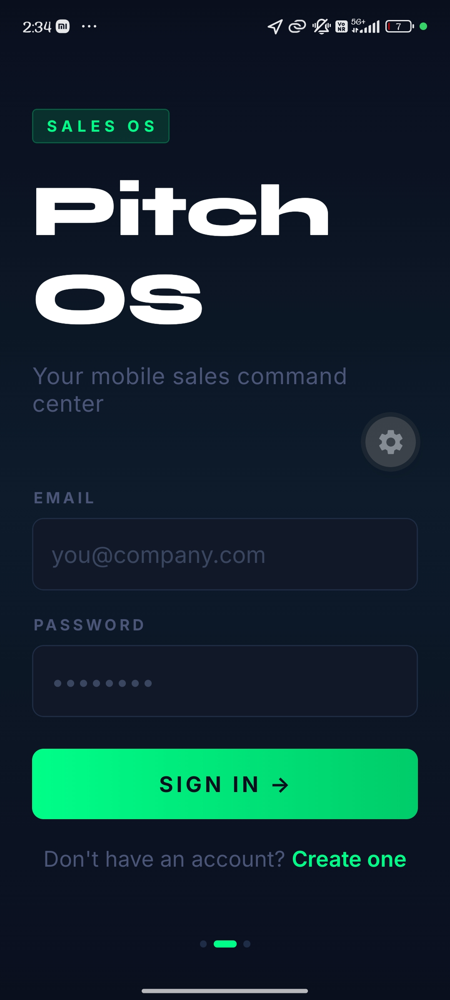
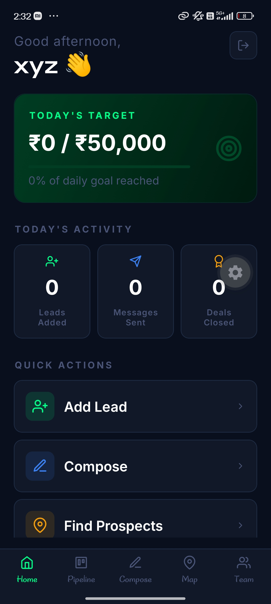
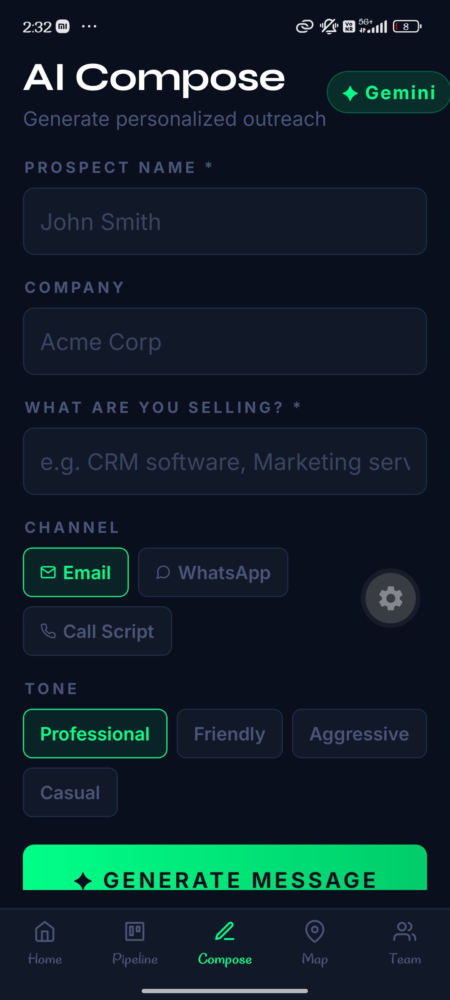
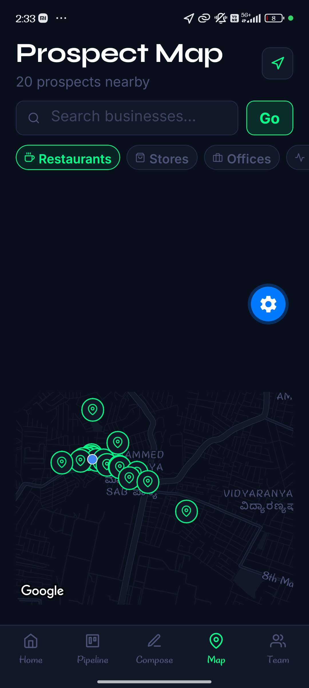
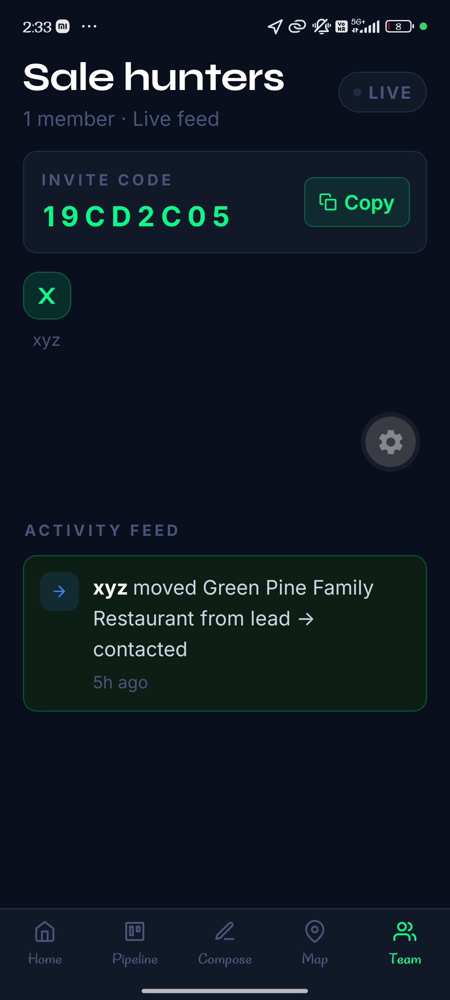

# PitchOS — AI-Powered Mobile Sales CRM

> A full-stack mobile sales command center for freelancers, small business owners, and sales reps who want to close deals faster — directly from their phone.

---

## 📱 Screenshots


| Login | Dashboard | Pipeline |
|-------|-----------|----------|
|  |  |  |

| AI Compose | Prospect Map | Team Feed |
|------------|--------------|-----------|
|  |  |  |

---

## ✨ Features

### 🤖 AI-Powered Outreach
- Generate personalized cold emails, WhatsApp messages, and call scripts in seconds
- Powered by **Gemini 2.5 Flash**
- Tone selector: Professional, Friendly, Aggressive, Casual
- Editable output — copy directly to clipboard

### 📊 Kanban Sales Pipeline
- 5-stage deal board: Lead → Contacted → Replied → Negotiating → Closed
- Add leads with contact details, deal value, and outreach channel
- One-tap status progression
- Total pipeline value tracking

### 📍 Location-Based Prospecting
- Discover nearby businesses using **Google Maps SDK** + **Places API**
- Filter by category: Restaurants, Stores, Offices, Gyms, Hospitals
- Search businesses by name
- Tap any pin → Add as lead or generate AI outreach in one tap

### ⚡ Real-Time Team Collaboration
- Create or join a team via invite code
- Live activity feed powered by **Supabase Realtime (WebSockets)**
- Every lead addition and deal movement appears instantly for the entire team
- No refresh needed — true real-time sync

### 🔐 Authentication & Security
- Email/password authentication via Supabase Auth
- Row Level Security (RLS) policies on all tables
- Persistent sessions with AsyncStorage
- Team-based data isolation

---

## 🛠️ Tech Stack

| Layer | Technology |
|-------|------------|
| Mobile Framework | React Native + Expo (SDK 55) |
| Language | TypeScript |
| Navigation | Expo Router (file-based) |
| Backend & Database | Supabase (Postgres) |
| Authentication | Supabase Auth |
| Real-time | Supabase Realtime (WebSockets) |
| AI | Google Gemini 2.5 Flash |
| Maps | react-native-maps (Google Maps) |
| Places | Google Places API |
| Build | EAS Build |
| Fonts | Syne + Inter (Google Fonts) |
| Icons | @expo/vector-icons (Feather) |

---

## 🚀 Getting Started

### Prerequisites

- Node.js 18+
- Expo CLI
- EAS CLI (`npm install -g eas-cli`)
- Supabase account
- Google Cloud account (Maps + Places API)
- Google AI Studio account (Gemini API)

### Installation

**1. Clone the repository**
```bash
git clone https://github.com/yourusername/PitchOS.git
cd PitchOS
```

**2. Install dependencies**
```bash
npm install
```

**3. Set up environment variables**

Create a `.env` file in the root directory:
```env
SUPABASE_URL=your_supabase_project_url
SUPABASE_ANON_KEY=your_supabase_anon_key
GEMINI_API_KEY=your_gemini_api_key
GOOGLE_MAPS_API_KEY=your_google_maps_api_key
```

Update `src/lib/supabase.ts` with your Supabase credentials and `app.json` with your Google Maps API key.

**4. Set up Supabase database**

Run these SQL queries in your Supabase SQL Editor:

```sql
-- Profiles table
create table profiles (
  id uuid references auth.users on delete cascade,
  full_name text,
  email text,
  avatar_url text,
  team_id uuid,
  role text default 'member',
  created_at timestamp default now(),
  primary key (id)
);

-- Teams table
create table teams (
  id uuid default gen_random_uuid() primary key,
  name text not null,
  invite_code text unique default substring(md5(random()::text), 1, 8),
  created_by uuid references auth.users,
  created_at timestamp default now()
);

-- Leads table
create table leads (
  id uuid default gen_random_uuid() primary key,
  user_id uuid references auth.users on delete cascade,
  name text not null,
  company text,
  email text,
  phone text,
  channel text default 'email',
  deal_value numeric default 0,
  status text default 'lead' check (status in ('lead', 'contacted', 'replied', 'negotiating', 'closed')),
  notes text,
  created_at timestamp default now(),
  updated_at timestamp default now()
);

-- Activities table
create table activities (
  id uuid default gen_random_uuid() primary key,
  user_id uuid references auth.users on delete cascade,
  team_id uuid references teams on delete cascade,
  user_name text,
  action text not null,
  lead_name text,
  lead_company text,
  from_status text,
  to_status text,
  deal_value numeric default 0,
  created_at timestamp default now()
);

-- Enable RLS
alter table profiles enable row level security;
alter table teams enable row level security;
alter table leads enable row level security;
alter table activities enable row level security;

-- Enable Realtime
alter publication supabase_realtime add table activities;
alter publication supabase_realtime add table leads;
```

**5. Run the app**
```bash
npx expo start --tunnel
```

---

## 📦 Building for Android

**Development build (for testing native features):**
```bash
eas build --platform android --profile development
```

**Production build:**
```bash
eas build --platform android --profile production
```

---

## 📁 Project Structure

```
src/
├── app/
│   ├── (auth)/
│   │   ├── login.tsx          # Login screen
│   │   └── signup.tsx         # Signup screen
│   ├── (tabs)/
│   │   ├── _layout.tsx        # Tab bar configuration
│   │   ├── index.tsx          # Dashboard screen
│   │   ├── pipeline.tsx       # Kanban pipeline screen
│   │   ├── compose.tsx        # AI compose screen
│   │   ├── map.tsx            # Prospect map screen
│   │   └── team.tsx           # Team feed screen
│   └── _layout.tsx            # Root layout + auth guard
├── lib/
│   └── supabase.ts            # Supabase client configuration
├── constants/
│   └── Fonts.ts               # Font definitions
└── assets/                    # Images, icons
```

---

## 🗄️ Database Schema

```
auth.users (Supabase built-in)
    │
    ├── profiles (1:1)
    │     ├── id
    │     ├── full_name
    │     ├── email
    │     └── team_id ──────────┐
    │                           │
    ├── leads (1:many)          │
    │     ├── id                │
    │     ├── user_id           │
    │     ├── name              │
    │     ├── company           │
    │     ├── status            │
    │     └── deal_value        │
    │                           ▼
    └── activities (1:many)   teams
          ├── id                ├── id
          ├── user_id           ├── name
          ├── team_id           └── invite_code
          └── action
```

---

## 🔑 API Keys Required

| Service | Where to get it | Used for |
|---------|----------------|----------|
| Supabase URL + Anon Key | [supabase.com](https://supabase.com) | Database, Auth, Realtime |
| Gemini API Key | [aistudio.google.com](https://aistudio.google.com) | AI message generation |
| Google Maps API Key | [console.cloud.google.com](https://console.cloud.google.com) | Maps SDK + Places API |

> ⚠️ Never commit API keys to version control. Use environment variables.

---

## 🤝 Contributing

Pull requests are welcome. For major changes, please open an issue first to discuss what you would like to change.

---

## 📄 License

[MIT](LICENSE)

---

## 👤 Author

**Aftab Nadeem**
- LinkedIn: [linkedin.com/in/aftabnadeem](https://linkedin.com/in/aftab-nadeem-b42772256)
- GitHub: [@aftabnadeem](https://github.com/aftabnadeem)

---

> Built with ❤️ using React Native + Supabase + Gemini AI
